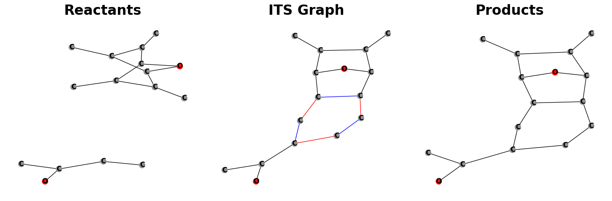
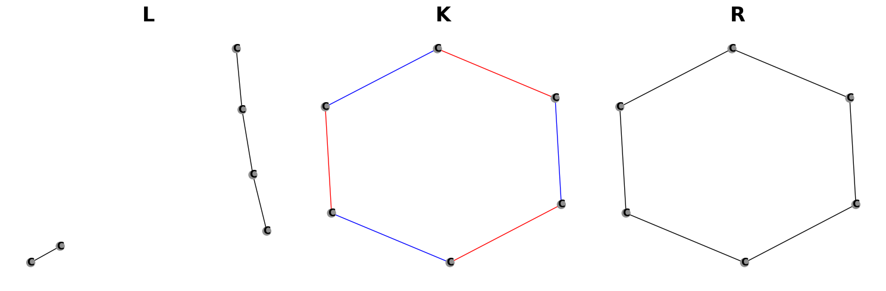

# SynTemp
Graph based Reaction Template Extraction 

## Overview
This repository is dedicated to the systematic extraction of reaction rules from chemical processes. The primary focus lies in the computational analysis and transformation of molecular reactions into a structured set of rules, facilitating a deeper understanding of reaction mechanisms and pathways.


### Step 1: Reaction Representation
The initial step involves the representation of chemical reactions, as illustrated below:


In this stage, we detail the reactants, products, and the overall reaction scheme, laying the foundation for subsequent computational analysis.

### Step 2: Atom-Atom Mapping (AAM) and ITS Graph Generation
Utilizing the Atom-Atom Mapping (AAM) technique, we identify and map corresponding atoms across reactants and products. This mapping is crucial for accurately delineating the Imaginary Transitional State (ITS) of the reaction. The ITS graph, derived from AAM, represents the transitional phase of the reaction, highlighting key changes and interactions at the atomic level.


### Step 3: Rules Extraction
In the final step, we focus on extracting the underlying rules from the ITS graph. This involves identifying significant nodes and edges that represent the core transformation mechanisms within the reaction. The extracted rules provide a concise and quantifiable description of the reaction process, instrumental for further analysis and application in computational chemistry.



## Table of Contents
- [Repository Structure](#repository-structure)
- [Installation](#installation)
- [Usage](#usage)
- [Features](#features)
- [Contributing](#contributing)
- [License](#license)
- [Acknowledgments](#acknowledgments)


## Repository Structure

SynTemp is organized into several key components, each dedicated to a specific aspect of chemical data processing:


## Installation

To install and set up the SynRBL framework, follow these steps. Please ensure you have Python 3.9 or later installed on your system.

### Prerequisites

- Python 3.11
- RDKit 2023.9.5
- networkx 3.2.1


### Step-by-Step Installation Guide

1. **Python Installation:**
  Ensure that Python 3.11 or later is installed on your system. You can download it from [python.org](https://www.python.org/downloads/).

2. **Creating a Virtual Environment (Optional but Recommended):**
  It's recommended to use a virtual environment to avoid conflicts with other projects or system-wide packages. Use the following commands to create and activate a virtual environment:

  ```bash
  python -m venv syntemp-env
  source syntemp-env/bin/activate  # On Windows use `synrbl-env\Scripts\activate`
  ```
  Or Conda

  ```bash
  conda create --name syntemp-env python=3.11
  conda activate syntemp-env
  ```

3. **Cloning and Installing SynTemp:**
  Clone the SynTemp repository from GitHub and install it:

  ```bash
  git clone https://github.com/TieuLongPhan/SynTemp.git
  cd SynTemp
  pip install .
  ```

4. **Verify Installation:**
  After installation, you can verify that SynTemp is correctly installed by running a simple test or checking the package version.

  ```python
  python -c "import SynTemp; print(SynTemp.__version__)"
  ```

## Usage

TODO


## Features

TODO

## Contributing


## License

This project is licensed under MIT License - see the [License](LICENSE) file for details.

## Acknowledgments

- TODO