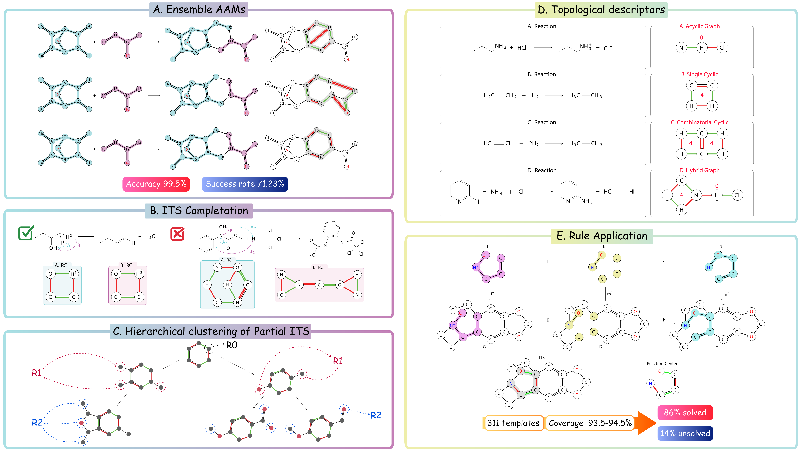

.. _getting-started-syntemp:

.. image:: https://img.shields.io/pypi/v/syntemp.svg
   :alt: PyPI version
   :align: right

============================
Getting Started with SynTemp
============================

Welcome to the **SynTemp** documentation! This guide helps you install, configure, and verify **SynTemp**, a modular toolkit for high‑quality reaction template extraction using ensemble atom mapping.

Contents
--------

.. toctree::
   :maxdepth: 2
   :hidden:

   installation
   verification
   tutorials

Introduction
------------

**SynTemp** systematically extracts reaction rules from chemical databases by transforming molecular reactions into structured templates. Our workflow comprises four core phases:

#. **AAM Inference**: Leverages ensemble atom‑atom mapping (AAM) for precise atom correspondence.
#. **Imaginary Transition State (ITS) Completion**: Infers implicit hydrogens to complete the ITS representation.
#. **Reaction Center Detection & Extension**: Identifies core reactive sites and propagates neighboring atoms to capture context.
#. **Hierarchical Clustering**: Aggregates extended centers or partial ITS into clusters to reveal common reaction motifs.

Prerequisites
-------------

Before proceeding, ensure you have:

- **Python** 3.11 or later installed.
- (Optional) [`conda`](https://docs.conda.io/en/latest/) for environment management.

We strongly recommend using an isolated environment to prevent dependency conflicts.

Virtual Environment Setup
-------------------------

Choose one of the following methods:

**1. Using Python venv** (cross-platform)

.. code-block:: bash

   python3 -m venv syntemp-env
   source syntemp-env/bin/activate   # Linux/macOS
   syntemp-env\Scripts\activate      # Windows PowerShell

**2. Using Conda**

.. code-block:: bash

   conda create -n syntemp-env python=3.11
   conda activate syntemp-env

Installation
------------

Install core dependencies and **SynTemp**:

.. code-block:: bash

   pip install -r requirements.txt
   pip install "syntemp[all]"

This will install **SynTemp** along with all optional components.

Verification
------------

Confirm that **SynTemp** is correctly installed and check its version:

.. code-block:: bash

   python -c "import importlib.metadata as m; print(m.version('syntemp'))"

You should see the installed version number printed.

Further Resources
-----------------

- Full documentation: https://syntemp.readthedocs.io/en/latest/
- Tutorials and examples: :doc:`Tutorials and Examples <tutorial>`
- GitHub repository: https://github.com/TieuLongPhan/SynTemp
- Issue tracker: https://github.com/TieuLongPhan/SynTemp/issues

Support
-------

If you encounter problems or have questions, feel free to:

- Open an issue on GitHub.
- Join the discussion via the project's mailing list.

Happy templating with **SynTemp**!
